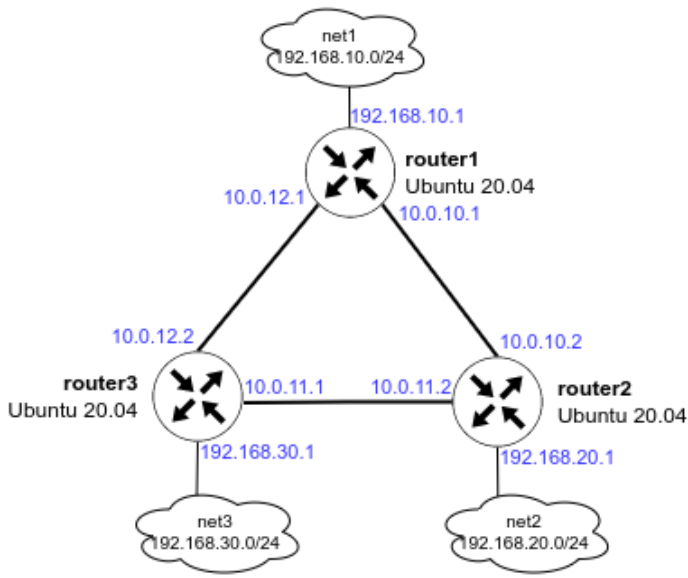

<h3>### OSPF ###</h3>

<h4>Описание домашнего задания</h4>

OSPF

<ol>
<li>Поднять три виртуалки</li>
<li>Объединить их разными vlan 
● поднять OSPF между машинами на базе Quagga; 
● изобразить ассиметричный роутинг; 
● сделать один из линков "дорогим", но что бы при этом роутинг был симметричным. 
Формат сдачи ДЗ - vagrant + ansible</li>
</ol>

<h4>1. Разворачиваем 3 виртуальные машины</h4>

Так как мы планируем настроить OSPF, все 3 виртуальные машины должны быть соединены между собой (разными VLAN), а также иметь одну (или несколько) доолнительных сетей, к которым, далее OSPF сформирует маршруты. Исходя из данных требований, мы можем нарисовать топологию сети:

Обратите внимание, сети, указанные на схеме не должны использоваться в Oracle Virtualbox, иначе Vagrant не сможет собрать стенд и зависнет. По умолчанию Virtualbox использует сеть 10.0.2.0/24. Если была настроена другая сеть, то проверить её можно в настройках программы:  
<b>VirtualBox — File — Preferences — Network — щёлкаем по созданной сети</b>

Создаём каталог, в котором будут храниться настройки виртуальной машины:

<pre>[user@localhost otus]$ mkdir ./ospf
[user@localhost otus]$</pre>

Перейдём в каталог ospf:

<pre>[user@localhost otus]$ cd ./ospf/
[user@localhost ospf]$</pre>

В каталоге создаём файл с именем Vagrantfile, добавляем в него следующее содержимое:

<pre># -*- mode: ruby -*-
# vi: set ft=ruby :

MACHINES = {
  :router1 => {
    :box_name => "ubuntu/focal64",
    :vm_name => "router1",
    :net => [
      {ip: '10.0.10.1', adapter: 2, netmask: "255.255.255.252", virtualbox__intnet: "r1-r2"},
      {ip: '10.0.12.1', adapter: 3, netmask: "255.255.255.252", virtualbox__intnet: "r1-r3"},
      {ip: '192.168.10.1', adapter: 4, netmask: "255.255.255.0", virtualbox__intnet: "net1"},
      {ip: '192.168.50.10', adapter: 5},
    ]
  },
  :router2 => {
    :box_name => "ubuntu/focal64",
    :vm_name => "router2",
    :net => [
      {ip: '10.0.10.2', adapter: 2, netmask: "255.255.255.252", virtualbox__intnet: "r1-r2"},
      {ip: '10.0.11.2', adapter: 3, netmask: "255.255.255.252", virtualbox__intnet: "r2-r3"},
      {ip: '192.168.20.1', adapter: 4, netmask: "255.255.255.0", virtualbox__intnet: "net2"},
      {ip: '192.168.50.11', adapter: 5},
    ]
  },
  :router3 => {
    :box_name => "ubuntu/focal64",
    :vm_name => "router3",
    :net => [
      {ip: '10.0.11.1', adapter: 2, netmask: "255.255.255.252", virtualbox__intnet: "r2-r3"},
      {ip: '10.0.12.2', adapter: 3, netmask: "255.255.255.252", virtualbox__intnet: "r1-r3"},
      {ip: '192.168.30.1', adapter: 4, netmask: "255.255.255.0", virtualbox__intnet: "net3"},
      {ip: '192.168.50.12', adapter: 5},
    ]
  }
}
Vagrant.configure("2") do |config|
  MACHINES.each do |boxname, boxconfig|
    config.vm.define boxname do |box|
      box.vm.box = boxconfig[:box_name]
      box.vm.host_name = boxconfig[:vm_name]
      if boxconfig[:vm_name] == "router3"
        box.vm.provision "ansible" do |ansible|
          ansible.playbook = "ansible/playbook.yml"
          ansible.inventory_path = "ansible/hosts"
          ansible.host_key_checking = "false"
          ansible.limit = "all"
        end
      end
      boxconfig[:net].each do |ipconf|
        box.vm.network "private_network", ipconf
      end
    end
  end
end</pre>

<h4>Первоначальная настройка Ansible</h4>

Для настроки хостов с помощью Ansible создадим структуру каталогов файлов.  
создаём каталог ansible, затем переходим в этот каталог:

<pre><pre>[user@localhost ospf]$ mkdir ./ansible && cd ./ansible/
[user@localhost ansible]$</pre>

В этом каталоге создадим необходимые конфиг файлы: 
● Конфигурационный файл ansible.cfg, который описывает базовые настройки для работы Ansible:

<pre>[defaults]
#Отключение проверки ключа хоста
host_key_checking = false
#Указываем имя файла инвентаризации
inventory = hosts
#Отключаем игнорирование предупреждений
command_warnings= false</pre>

● Файл инвентаризации hosts, который хранит информацию о том, как подключиться к хосту:

<pre>[routers]
router1 ansible_host=192.168.50.10 ansible_user=vagrant ansible_ssh_private_key_file=.vagrant/machines/router1/virtualbox/private_key
router2 ansible_host=192.168.50.11 ansible_user=vagrant ansible_ssh_private_key_file=.vagrant/machines/router2/virtualbox/private_key
router3 ansible_host=192.168.50.12 ansible_user=vagrant ansible_ssh_private_key_file=.vagrant/machines/router3/virtualbox/private_key</pre>

где:
- [servers] - в квадратных скобках указана группа хостов 
- router1 — имя нашего хоста (имена хостов и групп не могут быть одинаковые) 
- ansible_host — адрес нашего хоста 
- ansible_user — имя пользователя, с помощью которого Ansible будет подключаться к хосту 
- ansible_ssh_private_key — адрес расположения ssh-ключа 
В файл инвентаризации также можно добавлять переменные, которые могут автоматически добавляться в jinja template. Добавление переменных будет рассмотрено далее.

● Ansible-playbook playbook.yml — основной файл, в котором содержатся инструкции (модули) по настройке для Ansible или включает другие playbook файлы или роли, как в нашем случае:

<pre>---
- name: OSPF | Install and Configure
  hosts: all
  become: true

  roles:
    - { role: ospf, when: ansible_system == 'Linux' }</pre>

Затем создаём каталог roles:

<pre>[user@localhost ansible]$ mkdir ./roles
[user@localhost ansible]$</pre>

Перейдём в этот каталог и с помощью команды ansible-galaxy init создадим структуру каталогов:

<pre>[user@localhost ansible]$ cd ./roles/
[user@localhost roles]$ ansible-galaxy init ospf
- Role ospf was created successfully
[user@localhost roles]$</pre>

<h4>Установка пакетов для тестирования и настройки OSPF</h4>

Перед настройкой FRR рекомендуется поставить базовые программы для изменения конфигурационных файлов (vim) и изучения сети (traceroute, tcpdump, net-tools):

<pre>apt -y update
apt -y install vim traceroute tcpdump net-tools</pre>

Установка пакетов с помощью Ansible

<pre>#Начало файла provision.yml
- name: OSPF
  #Указываем имя хоста или группу, которые будем настраивать
  hosts: all
  #Параметр выполнения модулей от root-пользователя
  become: yes
  #Указание файла с дополнителыми переменными (понадобится при добавлении темплейтов)
  vars_files:
  - defaults/main.yml
  tasks:
  # Обновление пакетов и установка vim, traceroute, tcpdump, net-tools
  - name: install base tools
    apt:
      name:
      - vim
      - traceroute
      - tcpdump
      - net-tools
      state: present
      update_cache: true</pre>

<h4>2.1 Настройка OSPF между машинами на базе Quagga</h4>

Пакет Quagga перестал развиваться в 2018 году. Ему на смену пришёл пакет FRR, он построен на базе Quagga и продолжает своё развитие. В данном руководстве настойка OSPF будет осуществляться в FRR.

Процесс установки FRR и настройки OSPF вручную: 
1) Отключаем файерволл ufw и удаляем его из автозагрузки:

<pre>systemctl stop ufw
systemctl disable ufw</pre>

2) Добавляем gpg ключ:

<pre>curl -s https://deb.frrouting.org/frr/keys.asc | sudo apt-key add -</pre>

3) Добавляем репозиторий c пакетом FRR:

<pre>echo deb https://deb.frrouting.org/frr $(lsb_release -s -c) frr-stable > /etc/apt/sources.list.d/frr.list</pre>

4) Обновляем пакеты и устанавливаем FRR:

<pre>sudo apt update
sudo apt install frr frr-pythontools</pre>

5) Разрешаем (включаем) маршрутизацию транзитных пакетов:

<pre>sysctl net.ipv4.conf.all.forwarding=1</pre>

6) Включаем демон ospfd в FRR 
Для этого открываем в редакторе файл /etc/frr/daemons и меняем в нём параметры для пакетов zebra и ospfd на yes:

<pre>vim /etc/frr/daemons
zebra=yes
ospfd=yes
bgpd=no
ospf6d=no
ripd=no
ripngd=no
isisd=no
pimd=no
ldpd=no
nhrpd=no
eigrpd=no
babeld=no
sharpd=no
pbrd=no
bfdd=no
fabricd=no
vrrpd=no
pathd=no</pre>

В примере показана только часть файла

7) Настройка OSPF 
Для настройки OSPF нам потребуется создать файл /etc/frr/frr.conf, который будет содержать в себе информацию о требуемых интерфейсах и OSPF. Разберем пример создания файла на хосте router1.

Для начала нам необходимо узнать имена интерфейсов и их адреса. Сделать это можно с помощью двух способов: 
● Посмотреть в linux: ip a | grep inet

<pre>root@router1:~# ip a | grep "inet "
    inet 127.0.0.1/8 scope host lo
    inet 10.0.2.15/24 brd 10.0.2.255 scope global dynamic enp0s3
    inet 10.0.10.1/30 brd 10.0.10.3 scope global enp0s8
    inet 10.0.12.1/30 brd 10.0.12.3 scope global enp0s9
    inet 192.168.10.1/24 brd 192.168.10.255 scope global enp0s10
    inet 192.168.50.10/24 brd 192.168.50.255 scope global enp0s16
root@router1:~#</pre>

● Зайти в интерфейс FRR и посмотреть информацию об интерфейсах

<pre>root@router1:~# vtysh

Hello, this is FRRouting (version 8.1).
Copyright 1996-2005 Kunihiro Ishiguro, et al.

router1# show interface brief
Interface 	Status 	VRF 		Addresses
--------- 	------ 	--- 		---------
enp0s3 		up 		default 	10.0.2.15/24
enp0s8 		up 		default 	10.0.10.1/30
enp0s9 		up 		default 	10.0.12.1/30
enp0s10 	up 		default 	192.168.10.1/24
enp0s16 	up 		default 	192.168.50.10/24
lo 			up 		default

router1# exit
root@router1:~#</pre>

В обоих примерах мы увидем имена сетевых интерфейсов, их ip-адреса и маски подсети. Исходя из схемы мы понимаем, что для настройки OSPF нам достаточно описать интерфейсы enp0s8, enp0s9, enp0s10

Создаём файл /etc/frr/frr.conf и вносим в него следующую информацию:

<pre>!Указание версии FRR
frr version 8.1
frr defaults traditional
!Указываем имя машины
hostname router1
log syslog informational
no ipv6 forwarding
service integrated-vtysh-config
!
!Добавляем информацию об интерфейсе enp0s8
interface enp0s8
!Указываем имя интерфейса
description r1-r2
!Указываем ip-aдрес и маску (эту информацию мы получили в прошлом шаге)
ip address 10.0.10.1/30
!Указываем параметр игнорирования MTU
ip ospf mtu-ignore
!Если потребуется, можно указать «стоимость» интерфейса
!ip ospf cost 1000
!Указываем параметры hello-интервала для OSPF пакетов
ip ospf hello-interval 10
!Указываем параметры dead-интервала для OSPF пакетов
!Должно быть кратно предыдущему значению
ip ospf dead-interval 30
!
interface enp0s9
description r1-r3
ip address 10.0.12.1/30
ip ospf mtu-ignore
!ip ospf cost 45
ip ospf hello-interval 10
ip ospf dead-interval 30

interface enp0s10
description net_router1
ip address 192.168.10.1/24
ip ospf mtu-ignore
!ip ospf cost 45
ip ospf hello-interval 10
ip ospf dead-interval 30
!
!Начало настройки OSPF
router ospf
!Указываем router-id
router-id 1.1.1.1
!Указываем сети, которые хотим анонсировать соседним роутерам
network 10.0.10.0/30 area 0
network 10.0.12.0/30 area 0
network 192.168.10.0/24 area 0
!Указываем адреса соседних роутеров
neighbor 10.0.10.2
neighbor 10.0.12.2

!Указываем адрес log-файла
log file /var/log/frr/frr.log
default-information originate always</pre>

Сохраняем изменения и выходим из данного файла.

Вместо файла frr.conf мы можем задать данные параметры вручную из vtysh.
Vtysh использует cisco-like команды.
На хостах router2 и router3 также потребуется настроить конфигруационные
файлы, предварительно поменяв ip -адреса интерфейсов.
В ходе создания файла мы видим несколько OSPF-параметров, которые
требуются для настройки:
● hello-interval — интервал который указывает через сколько секунд
протокол OSPF будет повторно отправлять запросы на другие роутеры.
Данный интервал должен быть одинаковый на всех портах и роутерах, между
которыми настроен OSPF.
● Dead-interval — если в течении заданного времени роутер не отвечает на
запросы, то он считается вышедшим из строя и пакеты уходят на другой
роутер (если это возможно). Значение должно быть кратно hello-интервалу.
Данный интервал должен быть одинаковый на всех портах и роутерах, между
которыми настроен OSPF.
● router-id — идентификатор маршрутизатора (необязательный параметр), если
данный параметр задан, то роутеры определяют свои роли по данному
параметру. Если данный идентификатор не задан, то роли маршрутизаторов
13определяются с помощью Loopback-интерфейса или самого большого ip-адреса
на роутере.
8) После создания файлов /etc/frr/frr.conf и /etc/frr/daemons нужно
проверить, что владельцем файла является пользователь frr. Группа файла
также должна быть frr. Должны быть установленны следующие права:
● у владельца на чтение и запись
● у группы только на чтение
ls -l /etc/frr
Если права или владелец файла указан неправильно, то нужно поменять
владельца и назначить правильные права, например:
chown frr:frr /etc/frr/frr.conf
chmod 640 /etc/frr/frr.conf
9) Перезапускаем FRR и добавляем его в автозагрузку
systemct restart frr
systemctl enable frr
10) Проверям, что OSPF перезапустился без ошибок
root@router1:~# systemctl status frr
● frr.service - FRRouting
Loaded: loaded (/lib/systemd/system/frr.service; enabled; vendor preset:
enabled)
Active: active (running) since Wed 2022-02-23 15:24:04 UTC; 2h 1min ago
Docs: https://frrouting.readthedocs.io/en/latest/setup.html
Process: 31988 ExecStart=/usr/lib/frr/frrinit.sh start (code=exited,
status=0/SUCCESS)
Main PID: 32000 (watchfrr)
Status: "FRR Operational"
Tasks: 9 (limit: 1136)
Memory: 13.2M
CGroup: /system.slice/frr.service
├─32000 /usr/lib/frr/watchfrr -d -F traditional zebra ospfd
staticd
├─32016 /usr/lib/frr/zebra -d -F traditional -A 127.0.0.1 -s
90000000
├─32021 /usr/lib/frr/ospfd -d -F traditional -A 127.0.0.1
└─32024 /usr/lib/frr/staticd -d -F traditional -A 127.0.0.1
Feb 23 15:23:59 router1 zebra[32016]: [VTVCM-Y2NW3] Configuration Read in
Took: 00:00:00
Feb 23 15:23:59 router1 ospfd[32021]: [VTVCM-Y2NW3] Configuration Read in
Took: 00:00:00
Feb 23 15:23:59 router1 staticd[32024]: [VTVCM-Y2NW3] Configuration Read in
Took: 00:00:00
Feb 23 15:24:04 router1 watchfrr[32000]: [QDG3Y-BY5TN] staticd state -> up :
connect succeeded
Feb 23 15:24:04 router1 watchfrr[32000]: [QDG3Y-BY5TN] zebra state -> up :
connect succeeded
Feb 23 15:24:04 router1 watchfrr[32000]: [QDG3Y-BY5TN] ospfd state -> up :
connect succeeded
Feb 23 15:24:04 router1 watchfrr[32000]: [KWE5Q-QNGFC] all daemons up, doing
startup-complete notify
Feb 23 15:24:04 router1 frrinit.sh[31988]: * Started watchfrr
14Feb 23 15:24:04 router1 systemd[1]: Started FRRouting.
root@router1:~#
Если мы правильно настроили OSPF, то с любого хоста нам должны быть
доступны сети:
● 192.168.10.0/24
● 192.168.20.0/24
● 192.168.30.0/24
● 10.0.10.0/30
● 10.0.11.0/30
● 10.0.13.0/30
Проверим доступность сетей с хоста router1:
● попробуем сделать ping до ip-адреса 192.168.30.1
root@router1:~# ping 192.168.30.1
PING 192.168.30.1 (192.168.30.1) 56(84) bytes of data.
64 bytes from 192.168.30.1: icmp_seq=1 ttl=64 time=1.32 ms
64 bytes from 192.168.30.1: icmp_seq=2 ttl=64 time=1.15 ms
^C
--- 192.168.30.1 ping statistics ---
2 packets transmitted, 2 received, 0% packet loss, time 1005ms
rtt min/avg/max/mdev = 1.146/1.234/1.322/0.088 ms
root@router1:~#
● Запустим трассировку до адреса 192.168.30.1
root@router1:~# traceroute 192.168.30.1
traceroute to 192.168.30.1 (192.168.30.1), 30 hops max, 60 byte packets
1 192.168.30.1 (192.168.30.1) 0.997 ms 0.868 ms 0.813 ms
root@router1:~#
Попробуем отключить интерфейс enp0s9 и немного подождем и снова запустим
трассировку до ip-адреса 192.168.30.1
root@router1:~# ifconfig enp0s9 down
root@router1:~# ip a | grep enp0s9
4: enp0s9: <BROADCAST,MULTICAST> mtu 1500 qdisc fq_codel state DOWN group
default qlen 1000
root@router1:~# traceroute 192.168.30.1
traceroute to 192.168.30.1 (192.168.30.1), 30 hops max, 60 byte packets
1 10.0.10.2 (10.0.10.2) 0.522 ms 0.479 ms 0.460 ms
2 192.168.30.1 (192.168.30.1) 0.796 ms 0.777 ms 0.644 ms
root@router1:~#
Как мы видим, после отключения интерфейса сеть 192.168.30.0/24 нам
остаётся доступна.
● Также мы можем проверить из интерфейса vtysh какие маршруты мы видим на
данный момент:
root@router1:~#
root@router1:~# vtysh
Hello, this is FRRouting (version 8.1).
Copyright 1996-2005 Kunihiro Ishiguro, et al.
router1# show ip route ospf
Codes: K - kernel route, C - connected, S - static, R - RIP,
15O - OSPF, I - IS-IS, B - BGP, E - EIGRP, N - NHRP,
T - Table, v - VNC, V - VNC-Direct, A - Babel, F - PBR,
f - OpenFabric,
> - selected route, * - FIB route, q - queued, r - rejected, b -
backup
t - trapped, o - offload failure
O 10.0.10.0/30 [110/1000] is directly connected, enp0s8, weight 1,
02:50:21
O>* 10.0.11.0/30 [110/200] via 10.0.12.2, enp0s9, weight 1, 00:01:00
O 10.0.12.0/30 [110/100] is directly connected, enp0s9, weight 1,
00:01:00
O 192.168.10.0/24 [110/100] is directly connected, enp0s10, weight 1,
02:50:21
O>* 192.168.20.0/24 [110/300] via 10.0.10.2, enp0s9, weight 1, 00:01:00
O>* 192.168.30.0/24 [110/200] via 10.0.12.2, enp0s9, weight 1, 00:01:00
router1

